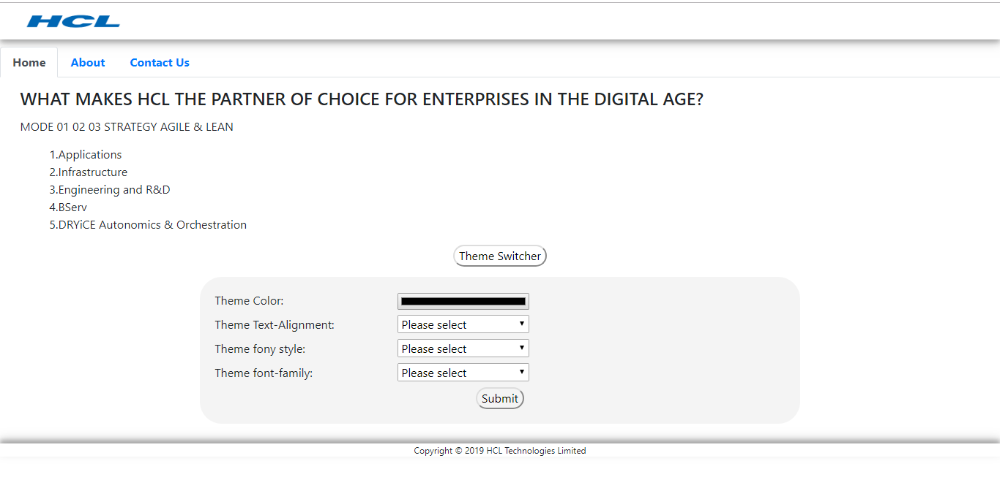
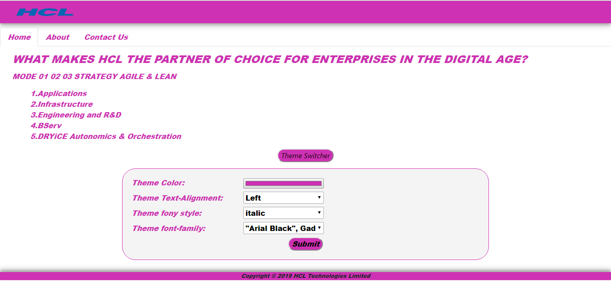

# EDGE-Components-Hackathon-2019
# Theme Change Component

The Theme Change component is useful for changing the theme of a page which is having the features like changing color,text-alignment,font-style and font-family of a page. 

  #### Before Applying Theme
  
  #### After Applying Theme
  

 To preview demo of Theme Change component, [Click here]()

## Using the complete angular project
Download the Theme Change Component folder and install the required packages and run the application.

### Installing

Installing node_module use command `npm install`

### Run server

Run `ng serve` for a dev server. Navigate to `http://localhost:4200/`. The app will automatically reload if you change any of the source files.

### Build

Run `ng build` to build the project. The build artifacts will be stored in the `dist/` directory. Use the `--prod` flag for a production build.

### HOW TO USE ?

