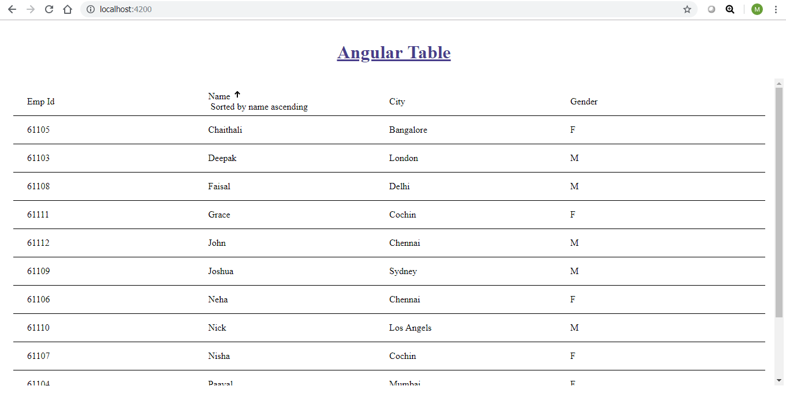

# EDGE-Components-Hackathon-2019

# Generic Angular Table Component

This is dynamic table component, which populates table header and body based on the given data.

## Live demo

* [Demo link] (https://github.com/ERS-HCL/EDGE-Components-Hackathon-2019/blob/ERSEDGE022019004/images/tableCompoenent.png)

## Dependancies

* Node and npm
* This project was bootstrapped using angula-cli.
* Angular Material

## How to make local setup.

* Clone the repository
* Run `npm install` 
* Run `ng serve`

## Image

