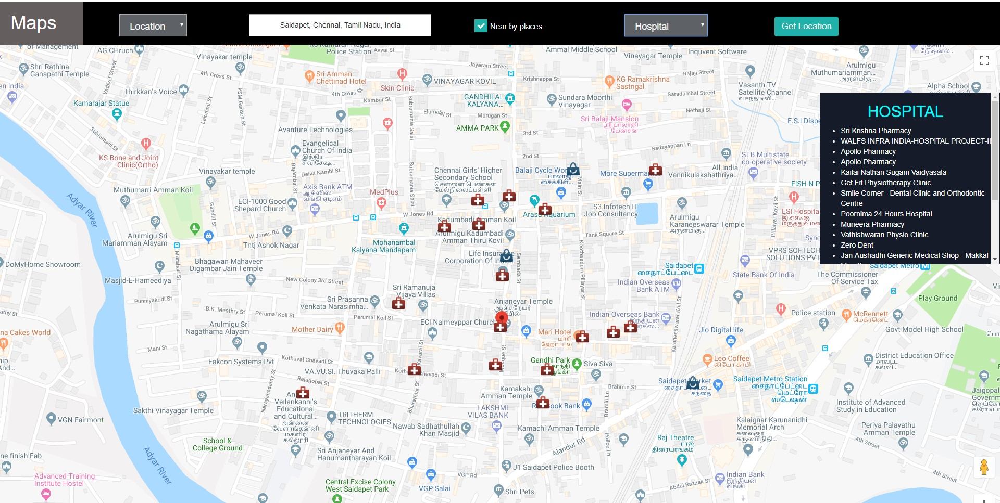
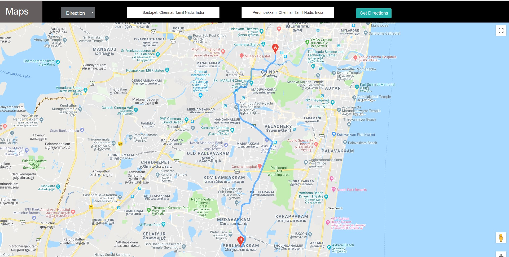

# EDGE-Components-Hackathon-2019

# Locate On Map

Locate on Map is a web component developed using angular 7 and bootstrap which is used to locate places on map. Further user can search for near by hospitals, schools, ATM etc for specified location and also find directions from source place to destination place. 





## Getting Started
### Installing
Following packages need to install in project
```
npm install
```
## Build

Run `ng build` to build the project. The build artifacts will be stored in the `dist/` directory. Use the `--prod` flag for a production build.

## Development server

Run `ng serve` for a dev server. Navigate to `https://angular-efumqq.stackblitz.io/`. The app will automatically reload if you change any of the source files.

## Running unit tests

Run `ng test` to execute the unit tests via [Karma](https://karma-runner.github.io).

## Running end-to-end tests

Run `ng e2e` to execute the end-to-end tests via [Protractor](http://www.protractortest.org/).
