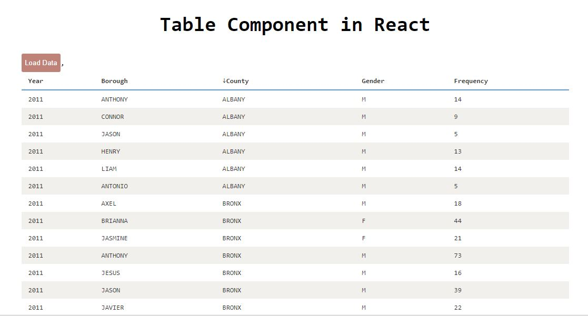

React Table Component
---

A simple sortable table component developed in react.

### Sample screens



### Get it running
Below are the steps to get it running.

 - Install all the dependences in the application by using the command ``` npm install ```
 - Then start the application by using command ``` npm start ```
 - Run the tests using command ``` npm test ```
 - Build for production ``` npm run build ```

### Usage
```javasript
const React = require('react');
const ReactTable = require('react-table');

const data = [
  {column1:'column1Data',  column2:'column2Data', column3:'column3Data', column4:'column4Data'},
  {column1:'column1Data',  column2:'column2Data', column3:'column3Data', column4:'column4Data'},
  {column1:'column1Data',  column2:'column2Data', column3:'column3Data', column4:'column4Data'},
  {column1:'column1Data',  column2:'column2Data', column3:'column3Data', column4:'column4Data'}
];

React.render(<ReactTable data={data} />, document.body);
```
